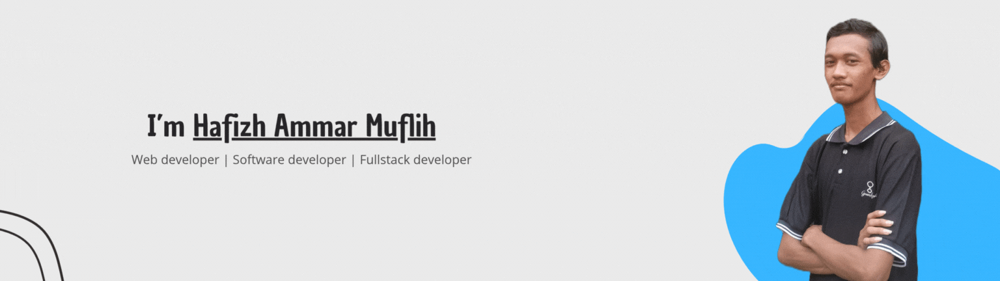

_An **IT Entusiast** with interest in **Web Development**_

  

<h3>What can i do?</h3>

- 🌱 **Make** some **program** with  and 

- ⚡ **Build** a **website** with , </a> , , , and 

- 🎮 **Make** a simple **game** with 

- 🤝 **Colaborate** with <a href="https://git-scm.com/" target="_blank" rel="noreferrer"> 

- 🎨 **Design** a **website** or **app** with 

<h3 align="center">Connect with me</h3>

