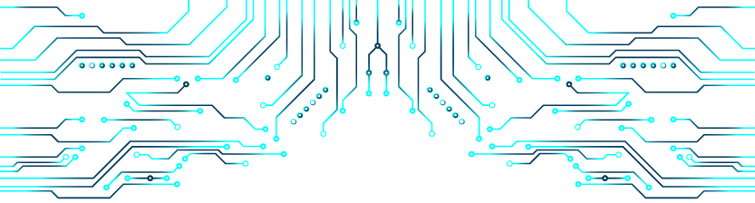

  

<h3 style="margin-top: 0; border-bottom: 5px solid lightskyblue; border-radius: 5px; display: inline-block; margin-bottom:5px;">Hafizh Ammar Muflih</h3>

_An **IT Entusiast** with interest in **Web Development**_

<h4>What can i do?</h4>

          

- 🌱 Make some program with **Python** and **C++**

- ⚡ Build a website with **React**, **HTML**, **CSS**, **Javascript**, and **Django**

- Make a simple game with **Unity**

- Colaborate with **Git**

- Design a website or app with **Figma**

<h4 align="left">Connect with me:</h4>

